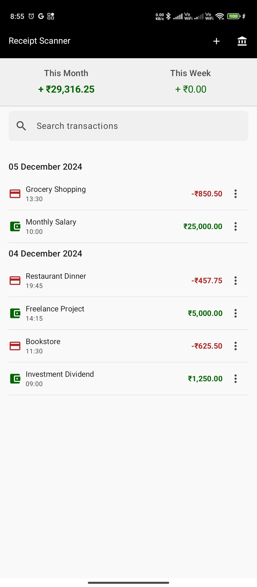
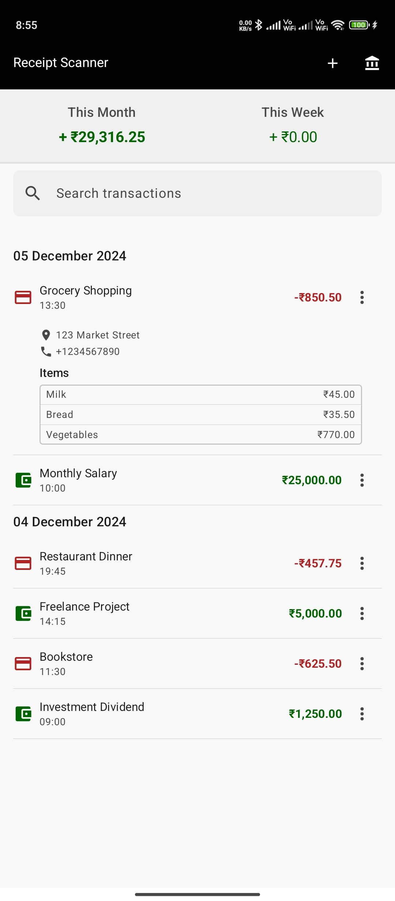
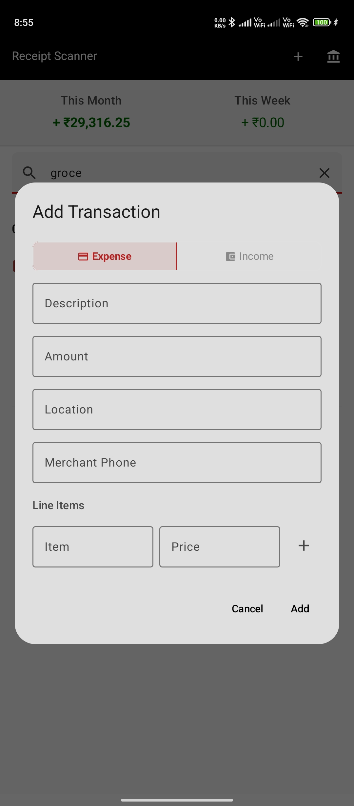
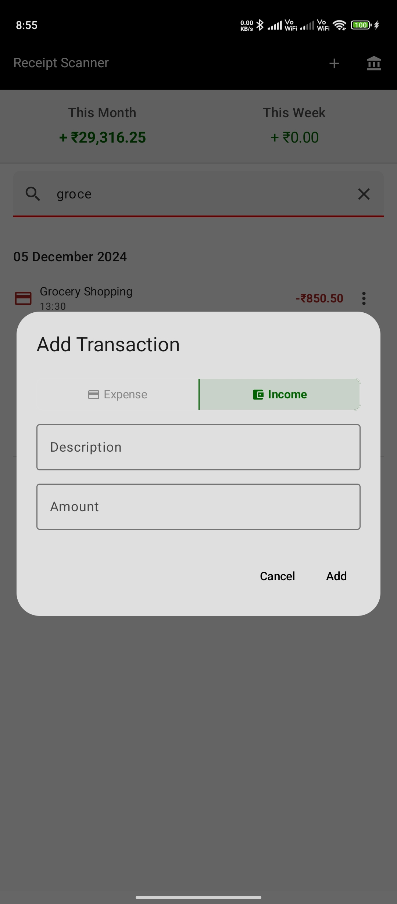
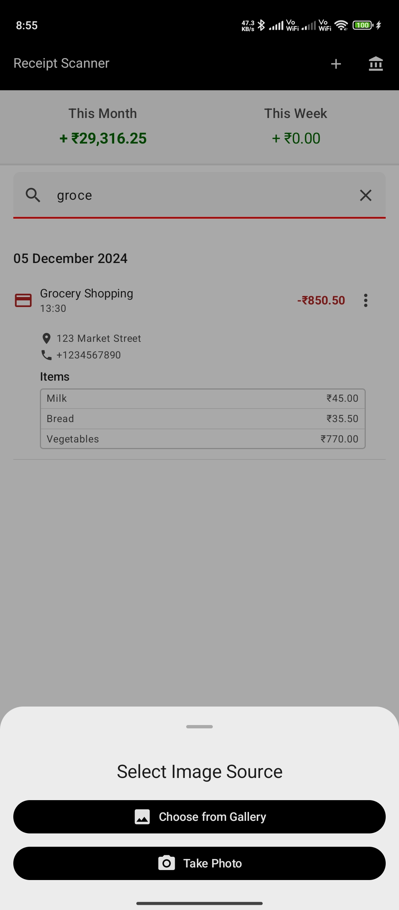
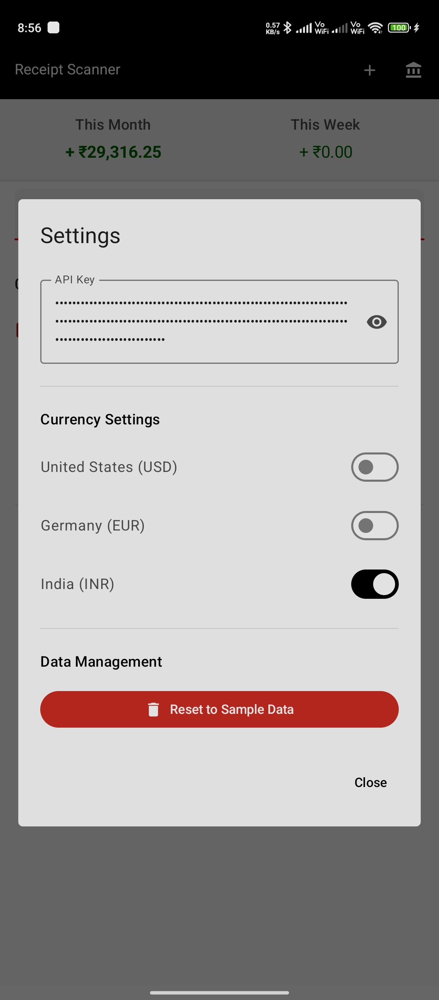

# LLM Receipt Scanner 🧾

An app to scan and store your receipts whenever you buy/pay-for something.
I wrote this for a college project, please don't have too many expectations from the code.

## Features

- Compatible with both OpenAI and Anthropic APIs (Might add support for ollama)
- **Extraction**: Automatically detects and extracts info like:
  - Item names and prices
  - Total amount
  - Date of purchase
  - Merchant details
  - Location of purchase

## Future Plans

- [ ] Add support for Ollama
- [ ] Implement batch processing
- [ ] Add export options (CSV, Excel)
- [ ] Add receipt categorization
- [ ] Build a web interface

## Screenshots

|  |  |  |
|:--------------------------------:|:--------------------------------:|:--------------------------------:|
|  |  |  |

## Contributing

Contributions are welcome! Feel free to submit issues and pull requests.

## License

This project is licensed under the MIT License - see the [LICENSE](LICENSE) file for details.
